# Kalazar Prediction Project

# Declining Kala-azar Cases: Hibernation for Resurgence or Journey towards True Extinction?  Exploring the Impact of Climate, Lankien, Republic of South Sudan. 

The prevalence of Kalazar/Visceral Leishmaniasis cases treated in Lankien hospital has been progressively decreasing, especially since the year 2020. While there was a notable frequent episode of flooding in the area, the reason behind the low number of VL cases remained uninvestigated.

**The possible scenarios could:**

*1) The climate change impact, for example, flooding has buried all the breeding sites of the sandflies.*

*2) The highest temperature has exceeded the previous temperature range, and adult sandflies cannot survive, so the transmission is low*

*3) Has the humidity and land surface temperature changed due to the temperature and flooding, and, hence, affected the Life cycle of Sandflies?*

*4) Kalazar has infected more people, and there is higher community-level immunity; hence, fewer severe cases seek treatment. False prevalence??*

*5) Most severe VL cases are seeking treatment in other facilities, hence false prevalence??*

*6) Has the community’s behaviour and way of living changed? Prevention methods applied? etc?*

**What is available for Lankien?**

*1) Seroprevalence survey?*

*2) Vector prevalence and behaviour study?*

*3) Kalazar and climate study?*

*4) Any other data available*

*Feb 2025, Juba, South Sudan*

[*Disclosure*]{.underline}*: This analysis was part of the routine deployment work in South Sudan, and hence it has not continued after 2023, due to lack of access to data. Yet this analysis is internal, with all the data protection and integrity for MSF respected.*

## Predicting KA cases using the historical KA cases 

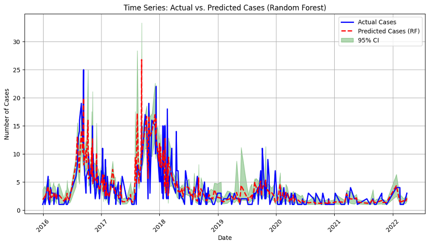

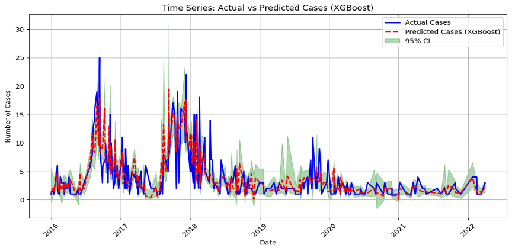

## Climate variables and VL cases treated in Lankien Hospital

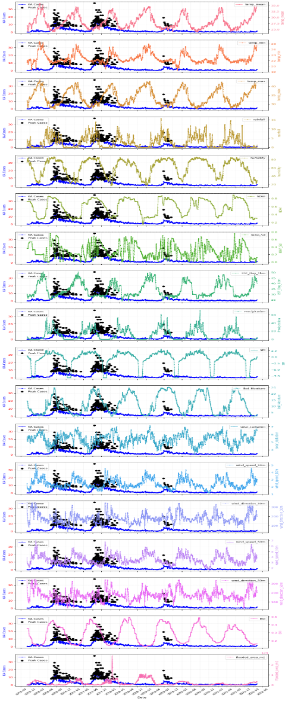

## Correlation between KA/VL cases and climate variables 

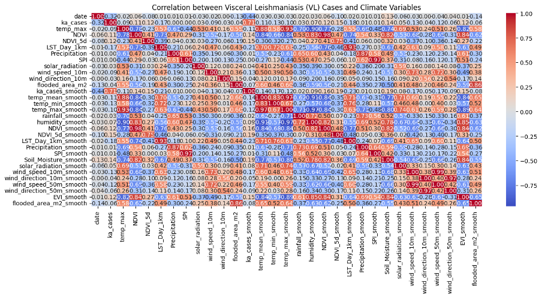

### Lagged variable and KA cases cross-correlation

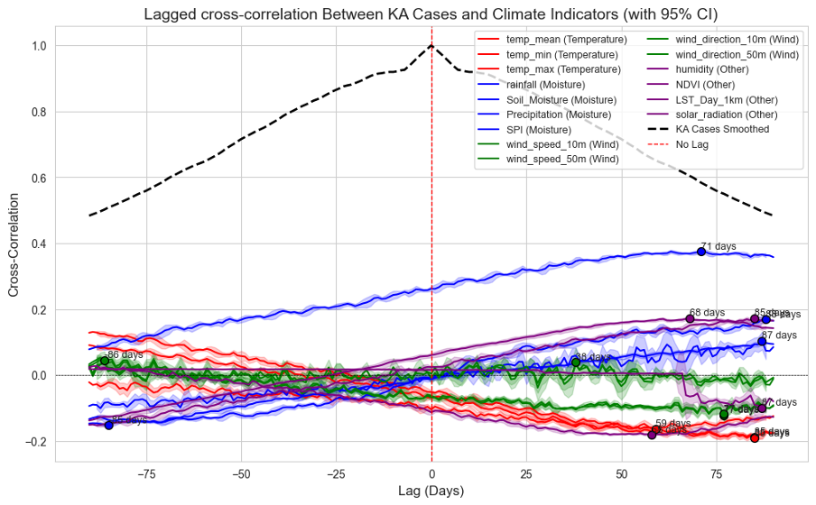

### Climate variables and KA cases using the Granger Causality Test (GCT)

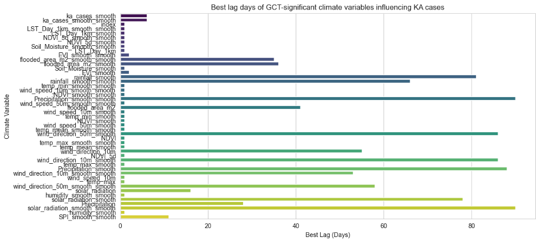

### Using Fourier transformation and seasonality

## Machine learning methods

Models without lagged time indicators

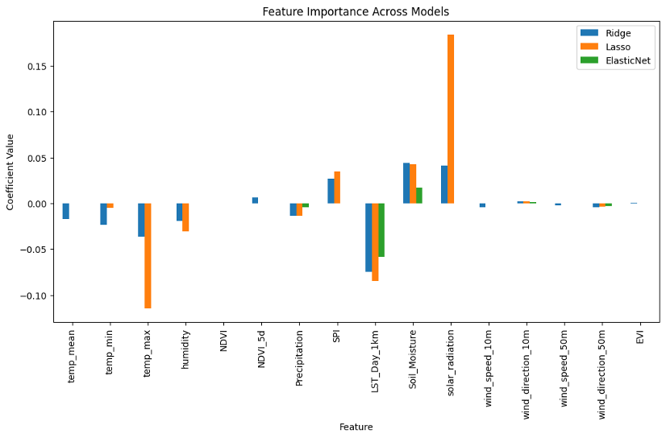

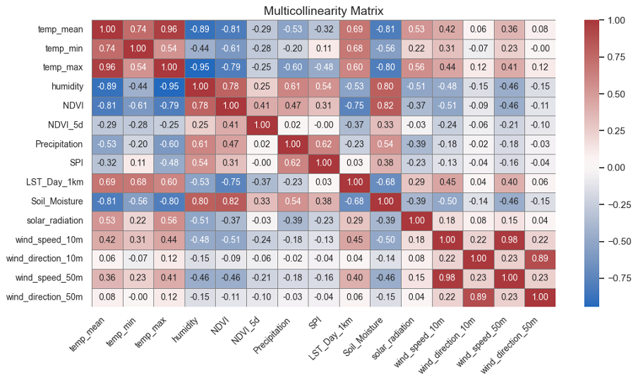

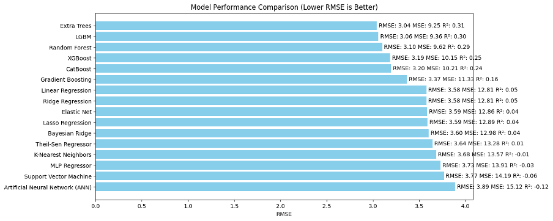

## Models with the variables with a lagged time

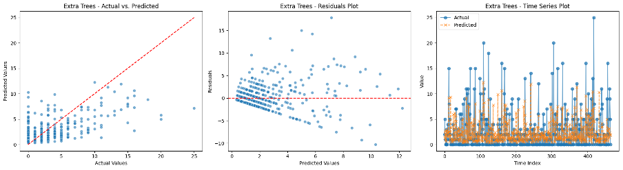

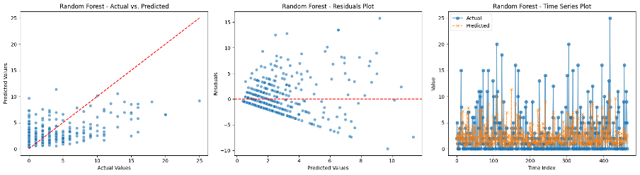

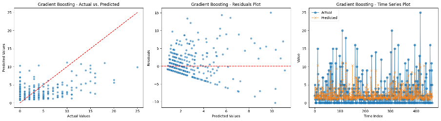

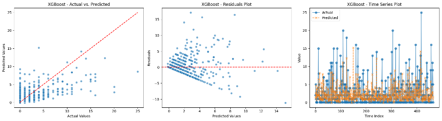

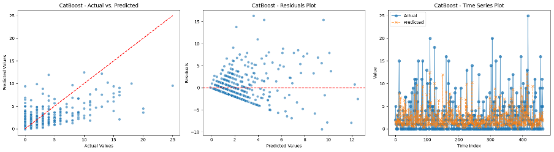

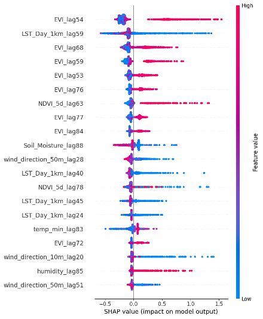

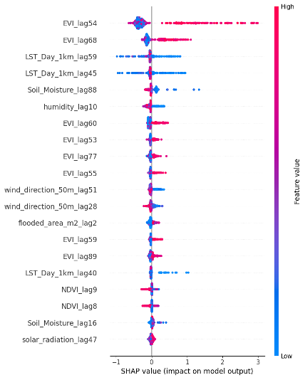

## **Partiall dependence plots** 

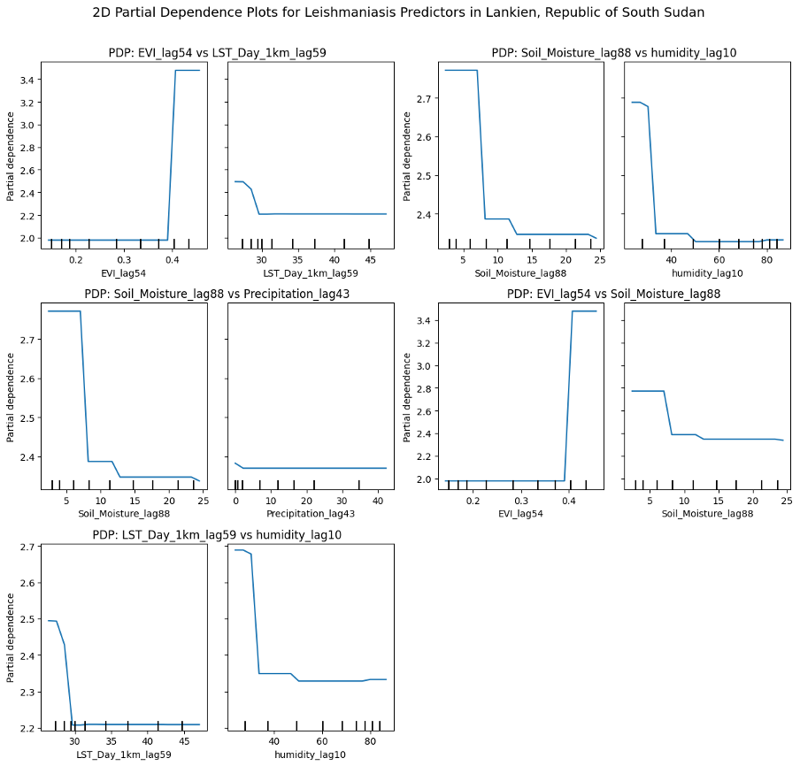

# Annexes 

#### 1. ARIMA time series predictions (train test 80, 20) 

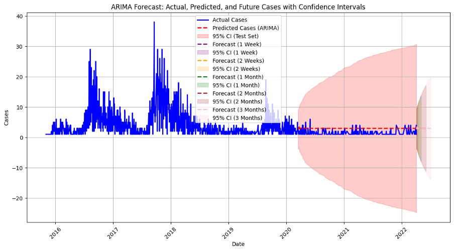

#### 2. LSTM Predictions (train test 80, 20)

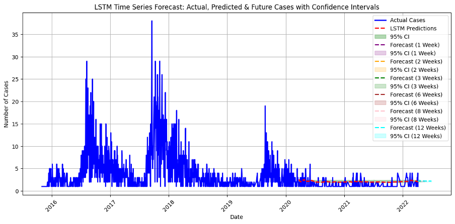

3.  **Random forest models fitted with the lagged KA cases autoregression**

    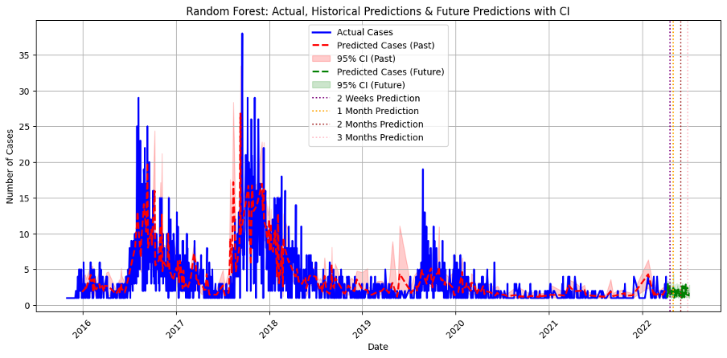

4.  **XGBoost autoregression models**

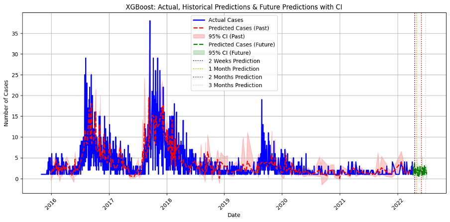